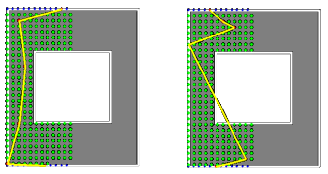
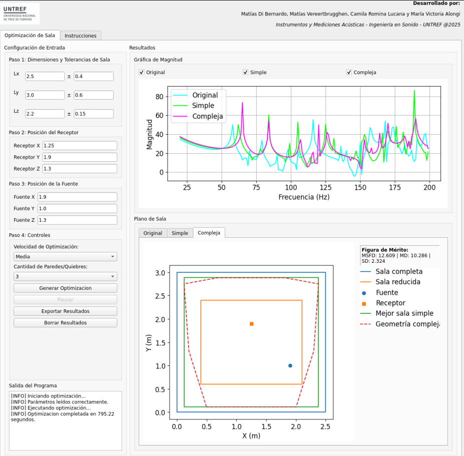
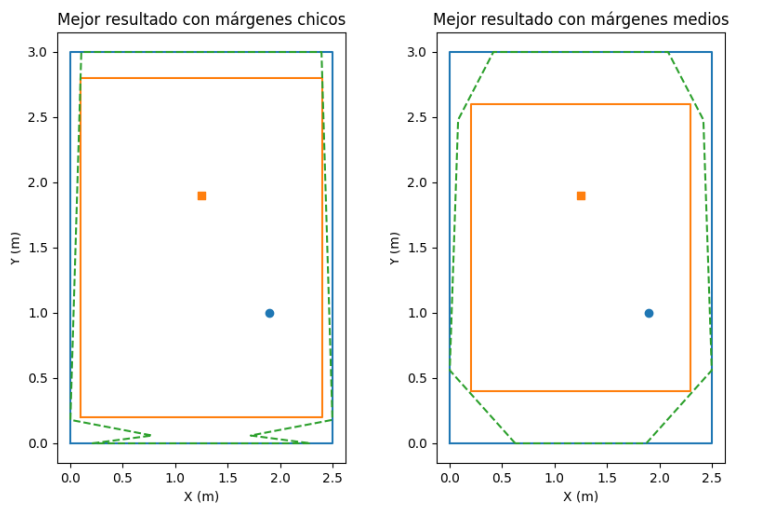
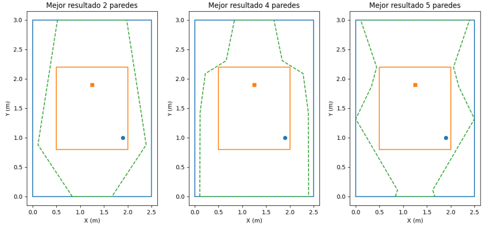
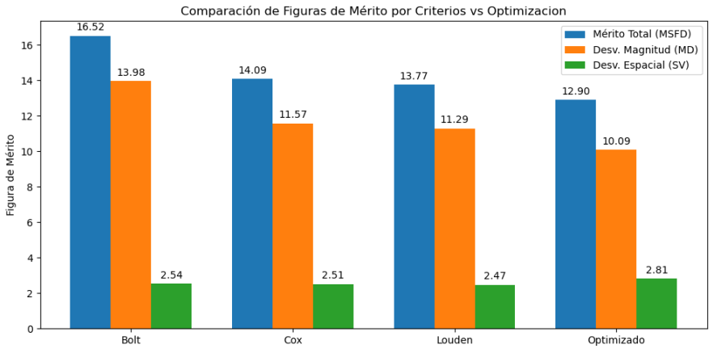

Este trabajo se desarrollo en el contexto de la materia *Instrumentos y Mediciones Acústicas* en UNTREF Argentina.
### **Introducción**

Las salas de control y los entornos de escucha crítica a menudo sufren de respuestas acústicas irregulares en bajas frecuencias. Estas irregularidades, causadas por una distribución dispersa de los modos de vibración, generan "coloraciones" que dificultan una evaluación sonora precisa. Tradicionalmente, se han utilizado criterios como los de Bonello, Bolt y Louden para optimizar la geometría de salas rectangulares y mejorar la distribución modal. Sin embargo, estas metodologías no consideran la influencia de contornos complejos ni la ubicación de la fuente y el oyente.

Este trabajo presenta una herramienta de código abierto desarrollada en **Python/FEniCS** que aborda estas limitaciones. El software utiliza la optimización geométrica por fuerza bruta sobre modelos de elementos finitos (FEM) para encontrar dimensiones y contornos de sala que proporcionen una distribución modal más uniforme.

### **Marco Teórico y Criterios Clásicos**

El comportamiento de las bajas frecuencias en un recinto está dominado por las ondas estacionarias, o modos normales, que se caracterizan por nodos y antinodos de presión. Los modos axiales, tangenciales y oblicuos, cuyas frecuencias dependen de las dimensiones de la sala, pueden generar problemas de coloración si se agrupan.

Los criterios clásicos de diseño, como los de **Bolt**, **Bonello** y **Louden**, se centran en evitar agrupamientos modales y proponen proporciones geométricas óptimas para salas rectangulares. Sin embargo, estos enfoques tienen una limitación importante: no consideran factores cruciales como la posición de la fuente sonora y el receptor, y están restringidos a geometrías simples.

### **Metodología y Desarrollo del Software**

La herramienta desarrollada combina un proceso de optimización en dos etapas.

1.  **Búsqueda Inicial:** Primero, el software realiza una búsqueda rápida en geometrías de paralelepípedos rectangulares utilizando el método clásico de superposición modal (SM) para identificar las proporciones geométricas iniciales más prometedoras.
2.  **Refinamiento y Optimización:** Luego, refina la búsqueda generando contornos planarios aleatorios con simetría forzada y aplica el **Método de Elementos Finitos en el dominio de la Frecuencia (FD-FEM)** para evaluar el mérito acústico de geometrías complejas. Este método es más preciso que la superposición modal para geometrías no rectangulares.

Para cuantificar el rendimiento acústico, se utiliza una figura de mérito combinada: la **Desviación Media del Campo Sonoro (MSFD)**. Esta métrica integra dos parámetros clave:
* **Desviación de Magnitud (MD):** Mide cuán plana es la respuesta en frecuencia en una posición específica.
* **Desviación Espacial (SD):** Mide la variación de la magnitud a lo largo del área de escucha.

La herramienta cuenta con una interfaz gráfica (GUI) en **PyQt5** que permite al usuario definir las dimensiones, márgenes y posiciones de fuente y receptor, y visualizar los resultados y las geometrías optimizadas.

### **Resultados y Conclusiones**

Los estudios de caso en tres volúmenes de salas de control de referencia mostraron mejoras de **MSFD de hasta 5 dB** en comparación con el diseño base. Los resultados demuestran que:

* **Impacto de los Márgenes:** A medida que se aumenta el espacio disponible para la optimización, se obtienen mejores resultados, mejorando la respuesta general en hasta 3 dB. Esta mejora se observa principalmente en la desviación de magnitud (MD).

* **Geometrías Complejas:** El aumento de la cantidad de paredes en la geometría compleja permite obtener soluciones superiores a las de los paralelepípedos simples, con una diferencia media de 1.3 dB en el factor de mérito. El proceso de optimización no produce una única solución, sino una variedad de geometrías que presentan un mínimo de MSFD.

* **Comparación con Criterios Tradicionales:** Una geometría optimizada compleja superó a las salas con dimensiones basadas en los criterios clásicos de Bolt, Louden y Cox. Aunque estos criterios son efectivos y de costo computacional nulo, la capacidad del software para modelar geometrías complejas y considerar la ubicación de fuentes y receptores provee una condición superior.

El estudio concluye que el software es una herramienta efectiva para la optimización de la acústica modal. Se sugieren mejoras futuras como la implementación de algoritmos de optimización más avanzados, como algoritmos genéticos, para reducir el tiempo de cálculo y mejorar la eficiencia del proceso.

Un análisis detallado del desarrollo de este algoritmo está disponible en el siguiente [trabajo](https://drive.google.com/file/d/1bFloyBC-lmMt_NCkeMwyjXit8-o1ZzsZ/view?usp=sharing).