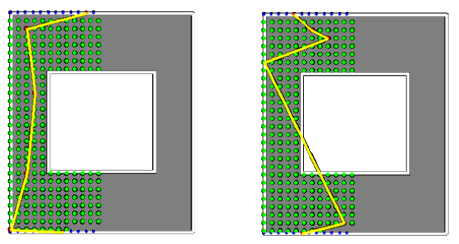
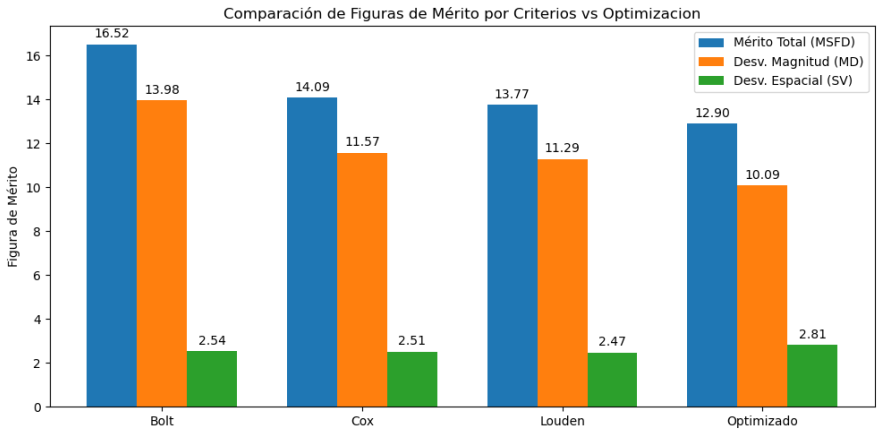

This work was developed in the context of the course *Instruments and Acoustic Measurements* at UNTREF Argentina.

### **Introduction**

Control rooms and critical listening environments often suffer from uneven low-frequency acoustic responses. These irregularities, caused by a clustered distribution of vibrational modes, produce “colorations” that hamper accurate sound evaluation. Traditionally, criteria such as those by Bonello, Bolt and Louden have been used to optimize the geometry of rectangular rooms and improve modal distribution. However, these methodologies do not consider the influence of complex boundaries nor the positions of source and listener.

This work presents an open-source tool developed in **Python/FEniCS** that addresses these limitations. The software uses geometric optimization by brute force over finite element models (FEM) to find room dimensions and contours that provide a more uniform modal distribution.

### **Theoretical Framework and Classical Criteria**

Low-frequency behavior in an enclosure is dominated by standing waves, or normal modes, which are characterized by pressure nodes and antinodes. Axial, tangential and oblique modes — whose frequencies depend on the room dimensions — can produce coloration problems when they cluster.

Classical design criteria, such as those of **Bolt**, **Bonello** and **Louden**, focus on avoiding modal clustering and propose optimal geometric ratios for rectangular rooms. However, these approaches have a major limitation: they do not consider crucial factors such as the position of the sound source and the receiver, and they are restricted to simple geometries.

### **Methodology and Software Development**

The developed tool combines a two-stage optimization process.

1. **Initial Search:** First, the software performs a rapid search on rectangular parallelepipeds using the classical modal superposition (MS) method to identify the most promising initial geometric proportions.
2. **Refinement and Optimization:** Then, it refines the search by generating random planar contours with enforced symmetry and applies the **Frequency-Domain Finite Element Method (FD-FEM)** to evaluate the acoustic merit of complex geometries. This method is more accurate than modal superposition for non-rectangular geometries.

To quantify acoustic performance, a combined figure of merit is used: the **Mean Sound Field Deviation (MSFD)**. This metric integrates two key parameters:

* **Magnitude Deviation (MD):** Measures how flat the frequency response is at a specific position.
* **Spatial Deviation (SD):** Measures the variation of magnitude across the listening area.

The tool includes a graphical user interface (GUI) in **PyQt5** that allows the user to define dimensions, margins, and source/receiver positions, and to visualize results and optimized geometries.

### **Results and Conclusions**

Case studies on three reference control-room volumes showed **MSFD improvements of up to 5 dB** compared to the baseline design. The results demonstrate that:

* **Impact of Margins:** As the available design space for optimization increases, better results are obtained, improving the overall response by up to 3 dB. This improvement is observed mainly in the Magnitude Deviation (MD).

* **Complex Geometries:** Increasing the number of walls in a complex geometry produces solutions superior to simple rectangular parallelepipeds, with a mean difference of 1.3 dB in the merit factor. The optimization process does not yield a single solution but a variety of geometries that present a minimum MSFD.

* **Comparison with Traditional Criteria:** A complex optimized geometry outperformed rooms dimensioned according to classic criteria by Bolt, Louden and Cox. Although these criteria are effective and computationally free, the software’s ability to model complex geometries and consider the locations of sources and receivers provides a superior condition.

The study concludes that the software is an effective tool for modal acoustic optimization. Future improvements are suggested, such as implementing more advanced optimization algorithms — for example, genetic algorithms — to reduce computation time and increase process efficiency.

A detailed analysis of the development of this algorithm is available in the following [paper](https://drive.google.com/file/d/1bFloyBC-lmMt_NCkeMwyjXit8-o1ZzsZ/view?usp=sharing).
