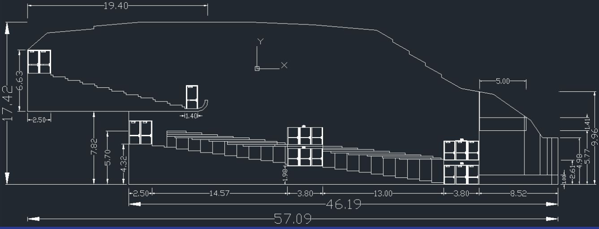
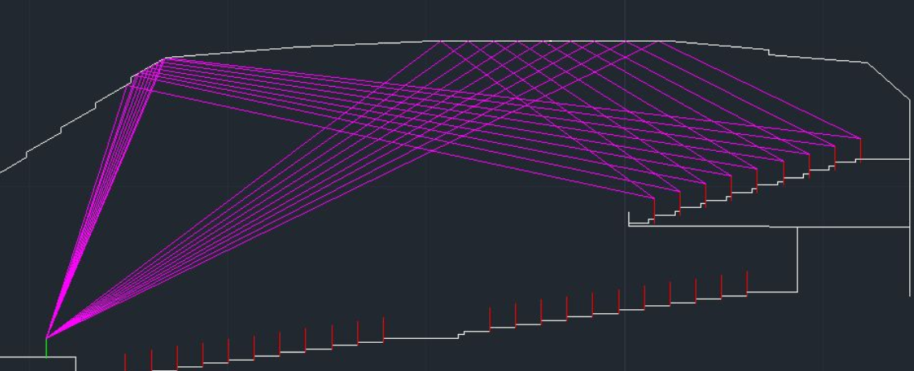
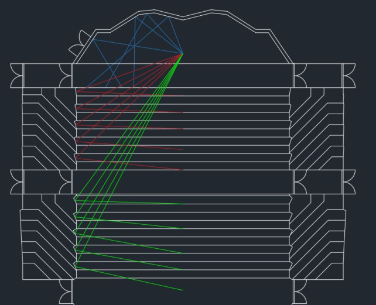
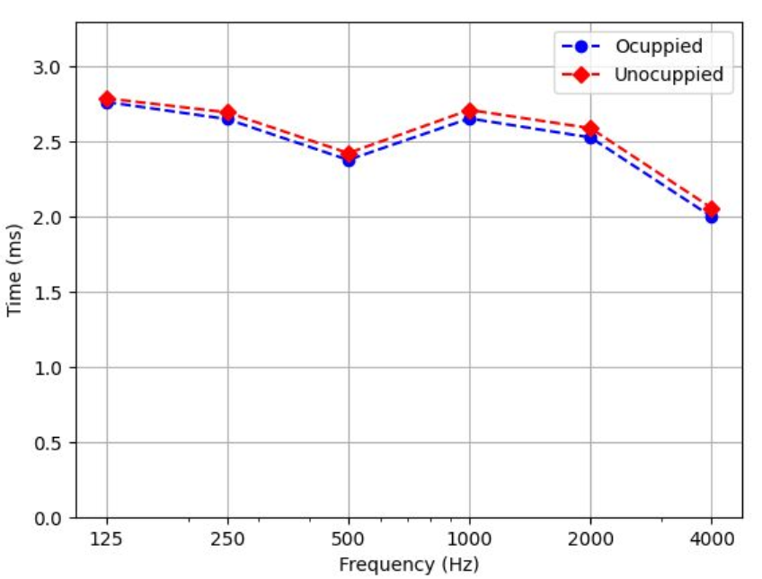

This project is the final assignment for the class *Acoustics and Psychoacoustics II*, where we were tasked with redesigning an existing auditorium. The goal was to apply the theory covered in class to create an acoustically optimized auditorium. For our project, we chose to redesign the Royal Albert Hall in London. This was particularly challenging due to the auditorium's vast dimensions, which make it difficult to ensure that sound reaches all spectators equally.

## Redesign Main Ideas
The redesign aimed to preserve the original concept of the auditorium, including its large volume and extensive seating capacity, while introducing critical changes to improve its acoustics. Although the primary focus was on acoustic enhancement, the redesign also considered other essential factors, such as sightlines and appropriate seat distribution.

Despite the intent to maintain the auditorium's original dimensions, its volume proved too large to achieve an optimal reverberation time. To address this, the redesign introduced an intermediate ceiling to reduce the spherical ceiling's volume, and the main seating area was reduced. These changes helped create a better reverberation time in the room, as illustrated in the cross-section below.

## Building Details and Regulations
To ensure a feasible and functional redesign, the following key aspects were carefully considered:
- Seat distribution
- Corridor spacing
- Sightline optimization
- Stage comfort

## Acoustic Treatment
Acoustic treatment was the most critical part of this study and focused on two main aspects: reflections and reverberation time.

### Reflections
Analyzing reflections is essential for the audience's acoustic experience. The original Royal Albert Hall features a spherical ceiling that centralizes reflections, creating undesirable acoustic effects. To mitigate this, the redesign incorporated an intermediate ceiling with a specific geometry designed to distribute reflections evenly across the audience.

The staggered ceiling design ensures adequate reflections for all seating rows. In the main balcony, two reflections were specifically addressed to compensate for the lower sound pressure level (SPL) caused by the large distance from the stage, as shown in the image below.

Lateral reflections were also optimized through adjustments to the stage geometry and the walls of the lateral balconies.

Additionally, the redesign sought to minimize the Initial Time Delay Gap (ITDG) across different audience locations.

### Materials and Reverberation Time
The redesign adhered to recommendations from *Acoustic Absorbers and Diffusers* to achieve a balance between absorption, diffusion, and specular reflections. Reflective materials were used for the ceiling and parts of the lateral balconies to ensure effective specular reflections. To lower the reverberation time (RT), materials with higher absorption coefficients were applied to other surfaces.

Using the selected materials and the Sabine equation, we calculated the auditorium's estimated RT. The resulting reverberation time for different frequencies is shown below:

The calculated mid-frequency RT is 2.51 seconds. While this is slightly above the recommended maximum of 2.4 seconds for optimal acoustics, it is acceptable given the auditorium's large volume.

## 3D Modelling
We rendered the redesigned auditorium using *SketchUp* software. Below are some of the visualizations:



## Conclusions
Redesigning the Royal Albert Hall to improve its acoustics while retaining its original essence presented significant challenges. The project required innovative solutions to address acoustic issues without compromising the hall's iconic design. Although some changes were necessary, the final result demonstrates a thoughtful redesign that enhances acoustics while preserving the auditorium's historical character. This project also deepened our understanding of acoustics and auditorium design principles.

A detailed description of this project can be found in the following [article](https://drive.google.com/file/d/1CkX-t_gx2s_YlKbrjB-5IK_dmZIkpJrd/view?usp=sharing).
