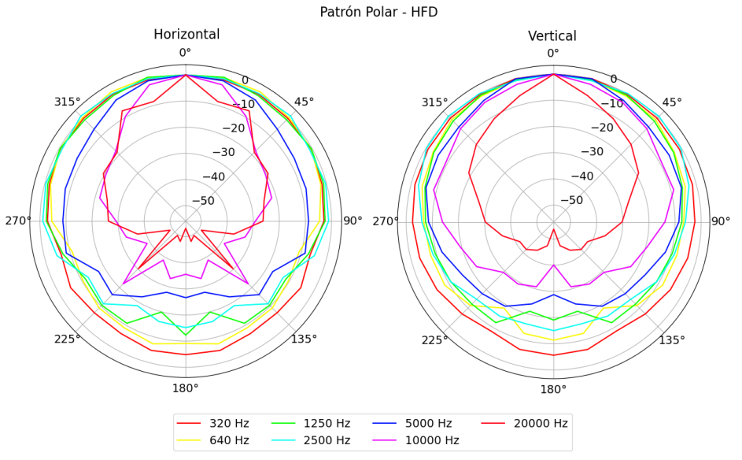
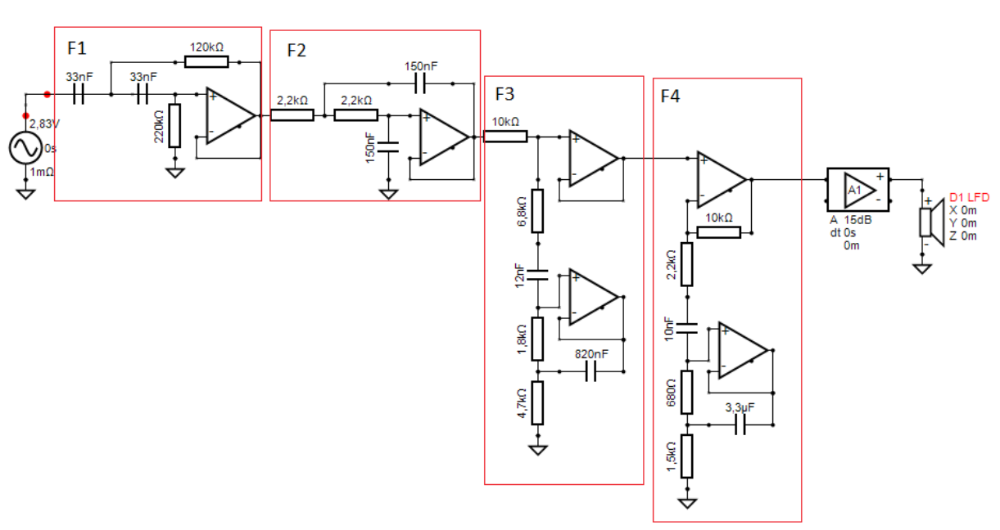

# "BassAdo": A Semi-Portable Low-Cost Home Speaker
This project is part of the Electroacoustics II course at UNTREF within the Sound Engineering program. The task was to design a speaker system from scratch by applying the theory and concepts explained in class.
The project was developed over the entire semester, with various stages to complete and present in reports. The speaker is intended for use in large spaces, potentially outdoors, to play music in a social gathering setting. It was named BassAdo to blend the Argentine tradition of "asado" (a typical barbecue gathering) with the word "bass," emphasizing the speaker’s low-frequency performance.

## Design
The goal was to design an accessible home audio system that allowed exploration of topics discussed in the course. The design aimed to emphasize bass response, characteristic of commercial systems, prioritizing low-frequency bandwidth extension over minimal group delay and system time control.

Regarding the transducers, the team had access to Yharo-brand units, which are classified as non-professional, consumer-grade, and suitable for automotive or home systems. The impedance response of the units was evaluated, and an 8” woofer was selected for low frequencies, along with two 4” units for mid/high frequencies.

Measuring the Thiele-Small parameters of the speakers revealed a high *Vas* (Equivalent Suspension Acoustic Volume), necessitating a large cabinet volume for proper control. To address this, and given the availability of two 8” woofers, the team opted for an isobaric speaker configuration, acoustically coupling the woofers to improve control and reduce cabinet size. Additionally, the cabinet was designed as vented to enhance low-frequency response.

The Thiele-Small parameters were obtained using the software [REW](https://www.roomeqwizard.com/). With these parameters, simulations were performed in [Basta!](https://www.tolvan.com/index.php?page=/basta/basta.php) to optimize the design for the desired response. A key focus was tuning the port’s resonance frequency to achieve strong low-frequency performance. The transducer had an *fs* of 45 Hz, and the port was tuned to 40 Hz by adjusting the tube length and cabinet air volume.

Based on these results, a 3D model of the cabinet was created using [SolidWorks](https://www.solidworks.com/), and the design was used to cut the materials for construction.

Details of this process are documented in the following [design report](https://drive.google.com/file/d/1uej1m6gwg99JoPEw5Jbu3cTq74ViIG58/view?usp=sharing).

## Construction
The wood was cut according to the 3D model, and the cabinet was assembled.



As shown in the images, rock wool was added as an acoustic absorber. Measurements revealed this was excessive (the port resonance was overly damped), so some rock wool was removed to achieve the desired result.

## Measurement and Calibration
Frequency response and directivity measurements were conducted in the university’s laboratory using the following equipment:

- Powersoft M50Q amplifier
- Earthworks M50 microphone
- RME Fireface UCX audio interface
- OUTLINE ET250-3D turntable

Using this setup and the [Arta](https://artalabs.hr/) software, the acoustic response of individual transducers was characterized (useful for crossover filter simulation). Vertical and horizontal directivity responses were also evaluated to determine the best orientation for use. Frequency response graphs for both transducers were generated.

All measurements and in-depth analysis are included in the following [measurement report](https://drive.google.com/file/d/1dPwJAqadPM3Ja80anA1P1Ei3EP9M8w-q/view?usp=sharing).

## Crossover Filter Design
Finally, the crossover filter stage was designed. Using the previous measurements, data were uploaded to [VituixCad](https://kimmosaunisto.net/) to calculate the simulations. The goal of the crossover filter was to achieve a pleasant frequency response for music playback and to enhance low frequencies. Vertical polar response uniformity was also a priority.

Since the power stage required an active supply, an active crossover filter with a Sallen-Key topology was implemented. The number of filters was defined based on space and cost, and adjustments were made in the software to achieve the desired response. For example, the low-frequency driver used the following configuration:

Where:
- F1: High-pass fs=30 Hz | Q=0.67
- F2: Low-pass fs=480 Hz | Q=0.5
- F3: Notch filter at 220 Hz
- F4: Notch filter at 400 Hz

Before building the filter, the proposed configuration was tested with a digital filter to practically evaluate the system’s response.
Details of this section are provided in the following [crossover filter report](https://drive.google.com/file/d/121wkPnp_QsODk99a2Jm44jfb-Xbl6ZKn/view?usp=sharing).

## Conclusions
This project allowed us to apply theoretical concepts in practice and gain a deeper understanding of the development and challenges involved in designing an electroacoustic system.