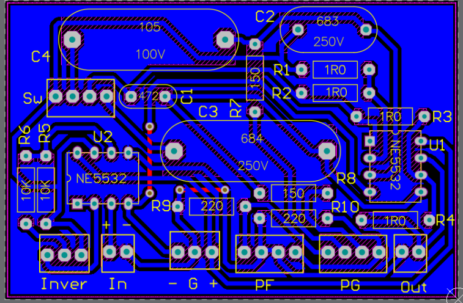

# Medidor THD+N
Un medidor de THD+N mide la distorsión armónica de un dispositivo. En audio, esto es crucial para evaluar la calidad del equipo. Este proyecto fue desarrollado como parte de la asignatura "Instrumentos y Mediciones Electrónicas" en UNTREF. En este curso, los estudiantes diseñan y desarrollan diversos instrumentos electrónicos, y los proyectos son continuados por grupos sucesivos de estudiantes. Este proyecto en particular ya estaba en marcha, y nuestro enfoque fue desarrollar un desfasador para alinear dos señales.

## Teoría sobre como medición de THD
Para medir la distorsión de un sistema, se introduce una señal sinusoidal con la menor distorsión posible al dispositivo bajo prueba. El objetivo es evaluar cuánta distorsión agrega el dispositivo a la señal. Esto se cuantifica midiendo la potencia de la señal original y la potencia de la señal después de pasar por el dispositivo, excluyendo la armónica fundamental.

Un amplificador diferencial se utiliza para restar la señal de salida del dispositivo de la señal de referencia, dejando solo las armónicas de orden superior.

El THD+N se calcula luego como un porcentaje usando la siguiente ecuación:

$$
THD+N = \frac{V_{filt}}{V_{tot}} \cdot 100
$$

Donde:
$V_{filt}$ es el valor RMS de la señal filtrada (excluyendo la armónica fundamental).
$V_{tot}$ es el valor RMS de la señal original.

## Desfasador
Para lograr una cancelación efectiva en la sección diferencial, se requieren ajustes precisos de fase y ganancia de las dos señales. El ajuste de ganancia había sido implementado con éxito por el grupo anterior que trabajó en el proyecto. Sin embargo, lograr la rotación de fase necesaria de 360 grados en toda la gama de frecuencias audibles (20 Hz a 20 kHz) presentó un desafío.

Para abordar este problema, diseñamos dos filtros pasa-todo en serie y calculamos los valores de los componentes para lograr la rotación de fase deseada en el rango de frecuencias objetivo.

El diseño fue modular para facilitar la integración con las etapas anteriores.

Probamos el circuito en un protoboard antes de diseñar la PCB utilizando *Altium Designer*.

## El dispositivo
El dispositivo cuenta con varios controles para ajustar la fase y la ganancia. Tanto los ajustes de fase como de ganancia incluyen potenciómetros de ajuste fino para garantizar la máxima precisión.



Está equipado con entradas y salidas BNC, lo que permite a los usuarios visualizar la salida en un osciloscopio y lograr la máxima atenuación.

## Resultados
Este dispositivo se comparó con un medidor de THD comercial (GW INSTEK GAD-201G), y los resultados fueron muy similares. La principal limitación fue el nivel de ruido base del entorno de medición, que restringió significativamente el valor más bajo de THD que pudimos medir.

Las especificaciones del dispositivo se resumen en la siguiente tabla (en español):

Un análisis detallado del dispositivo está disponible en este [informe](https://drive.google.com/file/d/1b36O_s27LkEJAZ6-y5TcdTT5wKB1xdGk/view?usp=sharing).
