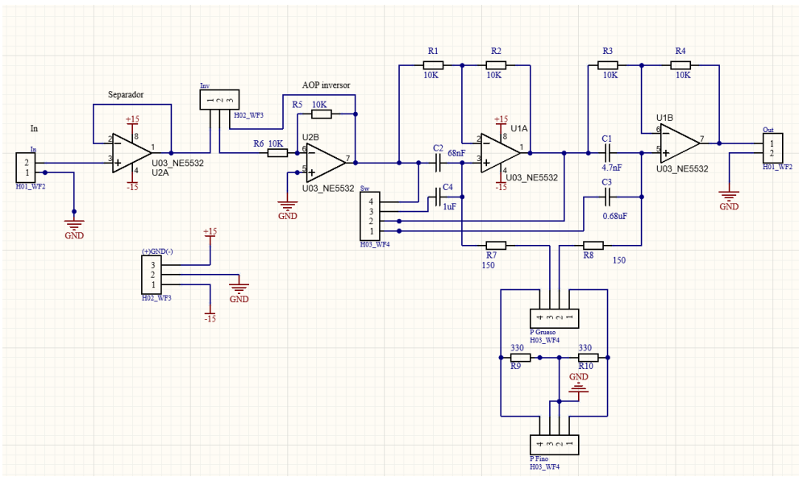
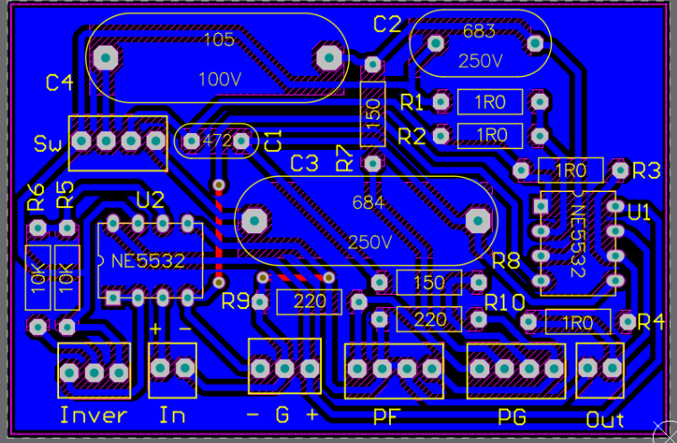

# THD+N Meter
A THD+N meter measures the harmonic distortion of a device. In audio, this is really importante to assert the quality of the equipmenet. This project was developed under the subjetct Instrumentos y Mediciónes Electrónicas en UNTREF. In this curse, different electronic equipement is developed by the students, and the projects contunue over curses. So this project there is already started, and we focus on developing a phase shifter to align two signals.

## Teory of THD measurement
To measure the distortion of a system, we input to the device a sinusodial signal (with the lowest distortion posible) and evaluate how much distortion the device add to this signal. To cuantify this we mesaure the power of the orignal signal, and the power of the signal going througt the device but without the fundamental harmonic. To eliminate the fundamental harmoinc, we use a diferential amplifier to substract the device signal and the reference signal and leaving only the superior harmonics.

After that, the THD+N in porcentage is measure with the following equation:
$$
THD+N = \frac{V_{filt}}{V_{tot}} \cdot 100
$$

Where $V_{filt}$ is the RMS value of the filtered signal (whitout the fundamental) and $V_{tot}$ is the RMS value of the original singal.

## Phase Shifter
In order to achieve a great cancelation in the diferential section, we need to adjust precisely the phase and gain of the two signals. The gain adjustment was succsefully implemented by the previous group that works on the project, but for the phase there was problems to achive the necesary 360 degree of rotation for all the frecuencies that we need to cover (audible range from 20 Hz to 20 kHz).
For this propose, we desing a two all pass filter in series and calculate the values to achive the desire rotation for the desire frecuency range.

The design was modular for an easily integration to the previous.

We test the circuit in protoboard and then design the PCB with Altium Designer.

## The device
The device has several controls to adjust phase and gain. Both phase and gain have a fine potenciometer to make small adjustment to achieve the maximum precision.



It has BNC inputs and outputs to visualice the output on the osciloscope and be able to achieve the maximum atenuation.

## Results
This device was compared against a commercial THD meter (GW INSTEK GAD - 201G) and the results were very similar. The principal limitation was the base noise level of the measurement environment that significantly limits the lowest THD value that we were able to measure.

The specification for the device are condense on the following specification table (in spanish):

A detail analysis of the device can be found in this [final report](https://drive.google.com/file/d/1b36O_s27LkEJAZ6-y5TcdTT5wKB1xdGk/view?usp=sharing) (written in spanish).