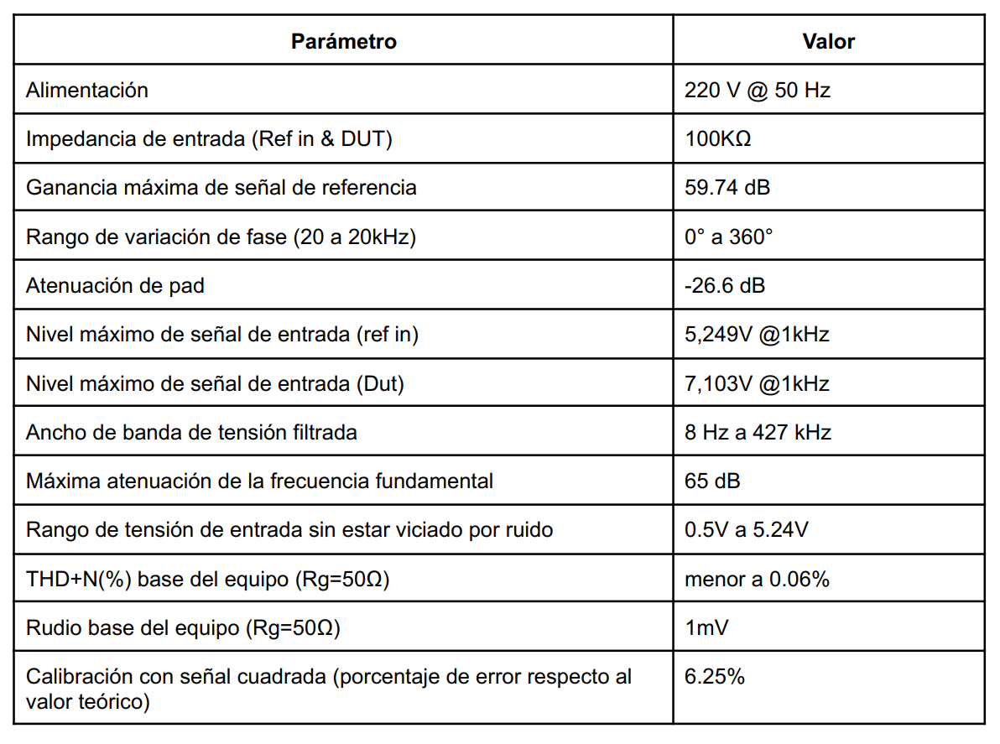

# THD+N Meter
A THD+N meter measures the harmonic distortion of a device. In audio, this is crucial for assessing the quality of equipment. This project was developed as part of the subject "Instrumentos y Mediciones Electrónicas" at UNTREF. In this course, students design and develop various electronic instruments, and projects are carried forward by successive student groups. This particular project was already underway, and our focus was on developing a phase shifter to align two signals.

## Teory of THD measurement
To measure the distortion of a system, a sinusoidal signal with minimal distortion is input to the device under test. The goal is to evaluate how much distortion the device adds to the signal. This is quantified by measuring the power of the original signal and the power of the signal after passing through the device, excluding the fundamental harmonic.

A differential amplifier is used to subtract the device's output signal from the reference signal, leaving only the higher-order harmonics.

The THD+N is then calculated as a percentage using the following equation:

$$
THD+N = \frac{V_{filt}}{V_{tot}} \cdot 100
$$

Where:
$V_{filt}$ is the RMS value of the filtered signal (excluding the fundamental harmonic).
$V_{tot}$ is the RMS value of the original signal.

## Phase Shifter
To achieve effective cancellation in the differential section, precise phase and gain adjustments of the two signals are required. The gain adjustment had been successfully implemented by the previous group working on the project. However, achieving the necessary 360-degree phase rotation across the entire audible frequency range (20 Hz to 20 kHz) presented a challenge.

To address this, we designed two all-pass filters in series and calculated the component values to achieve the desired phase rotation over the target frequency range.

The design was modular to facilitate seamless integration with the previous stages.

We tested the circuit on a protoboard before designing the PCB using *Altium Designer*.

## The device
The device features several controls for adjusting phase and gain. Both the phase and gain adjustments include fine-tuning potentiometers to ensure maximum precision.



It is equipped with BNC inputs and outputs, allowing users to visualize the output on an oscilloscope and achieve maximum attenuation.

## Results
This device was compared against a commercial THD meter (GW INSTEK GAD-201G), and the results were highly similar. The primary limitation was the base noise level of the measurement environment, which significantly restricted the lowest THD value we could measure.

The specifications of the device are summarized in the following table (in Spanish):

A detailed analysis of the device is available in this [final report](https://drive.google.com/file/d/1b36O_s27LkEJAZ6-y5TcdTT5wKB1xdGk/view?usp=sharing) (written in spanish).