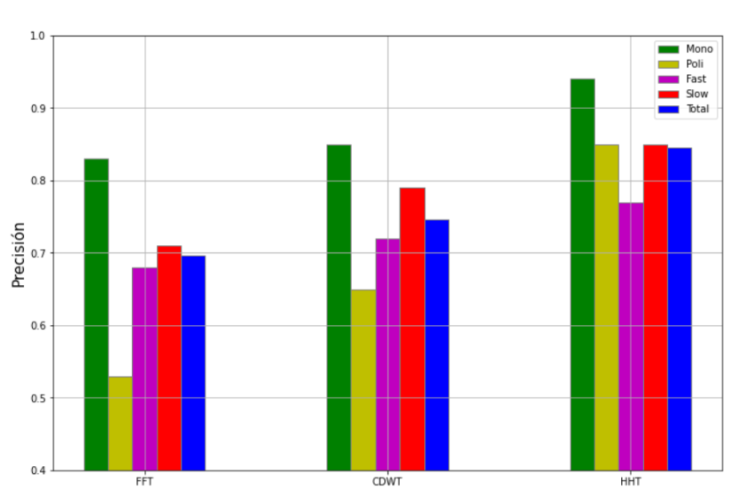

Esta investigación se desarrolla en el marco de la materia *Metodología de la Investigación* en UNTREF. En el artículo se pretende comparar las diferencias entre tres tipos de transformaciones tiempo-frecuencia:

1) Transformada de Fourier (FT)  
2) Transformada Wavelet (WT)  
3) Transformada Huang-Hilbert (HHT)  

El objetivo del trabajo es entender las diferencias entre estos tipos de transformaciones y profundizar mi conocimiento en el procesamiento de señales.

## Objetivo
El objetivo general de la investigación es determinar con qué herramienta de análisis espectral se logra una mayor precisión en la tarea de detección de tono.

Para alcanzar este objetivo, se plantean los siguientes puntos a completar:  

- Determinar los parámetros necesarios para representar la señal en el dominio espectral según cada caso.  
- Elegir un algoritmo que identifique el tono de la señal en base a su representación espectral.  
- Generar los datos (señales de audio) con los cuales se realizará la comparación.  
- Evaluar los datos generados con los distintos métodos de análisis y aplicar procesos estadísticos para validar los resultados.  
- Establecer una medida de precisión en la tarea de detección de tono.  
- Comparar los resultados de los distintos análisis y determinar cuál es el que consigue una mayor precisión en la detección de tono.  

Se eligió la tarea de detección de tono porque es una de las aplicaciones principales de este tipo de transformadas.

## Algoritmos
El análisis teórico de todas las transformadas se realiza en el dominio continuo, pero para llevar a cabo los experimentos y comparaciones se trabaja en el dominio discreto, de forma que todos los cálculos se realizan digitalmente.

### FFT
La FFT es un algoritmo que optimiza la DFT (Transformada de Fourier de tiempo discreto). Con este algoritmo se obtiene la representación espectral de la señal de acuerdo al análisis de Fourier, descomponiendo una señal compleja en una suma de senos o cosenos. La DFT se calcula mediante la fórmula:

$$
X_k = \sum_{n=0}^{N-1} e^{-i\frac{2\pi}{N}kn} x_n
$$

Donde \( N \) es la cantidad de muestras de la señal y \( k \) son los números naturales de \( 0 \) hasta \( N – 1 \).

### WT
La Transformada Wavelet (WT) utiliza una función ondulatoria (wavelet) y aplica una convolución entre la señal y la función de onda elegida para determinar si esa forma ondulatoria está presente en la señal. La onda se deforma en frecuencia y amplitud, permitiendo que una sola función ondulatoria recree todo el espectro de interés.

Para esta investigación se empleará la CDWT (Cyclic Discrete Wavelet Transform), la implementación más común al discretizar la WT. Conceptualmente, esta transformada extiende el análisis de Fourier utilizando una base de funciones ondulatorias en lugar de senos y cosenos. Se calcula así:

$$
Wf[n, a^j] = \sum_{m=0}^{N-1} f[m] \psi_j[m-n]
$$

Donde \( N \) es la cantidad de muestras de la señal, \( \psi \) es la función ondulatoria y \( j \) representa la deformación de la onda según el banco de ondas seleccionado.

### HHT
Por último, se empleará la Transformada Huang-Hilbert (HHT), que utiliza la Descomposición Empírica Modal (EMD) para descomponer la señal en subseñales relevantes. En lugar de descomponer en funciones senoidales u ondulatorias, el EMD encuentra funciones modales intrínsecas (IMF) específicas de cada señal. 

La relación entre las IMF y la frecuencia original se establece con la ecuación:  

$$
z(t) = f(t) + i H\{ f(t) \}
$$

Donde \( f(t) \) es una IMF y \( H \) es la Transformada Hilbert. Esto permite proyectar la señal al eje imaginario y extraer la amplitud y la fase de cada instante, construyendo la representación espectral. Como una señal generalmente tiene múltiples IMF, este proceso se repite para todas y se suman para obtener el espectro completo.

## Procedimiento
Se analizará la relación entre los tipos de representación espectral y la precisión en la detección de tono.

Primero, se seleccionarán los parámetros para las distintas transformadas, como el número de muestras para el ventaneo temporal, que determina la resolución temporal y frecuencial.

Para comparar los métodos, se generarán datos representativos de distintos casos de interés, modelando cuatro tipos de señales:

- **Monótonas**: Una sola nota correspondiente a la \( F_0 \).  
- **Politonales**: Múltiples notas, donde la armonía determina la \( F_0 \).  
- **Transiciones lentas**: Cambios de \( F_0 \) graduales.  
- **Transiciones rápidas**: Cambios de \( F_0 \) abruptos.  

Se comparará el valor real \( V(t) \) con el resultado \( P(t) \) de cada transformada, integrando la diferencia temporalmente para calcular la precisión.

## Resultados
En esta etapa, solo se requería completar el plan de investigación detallando el procedimiento y los métodos de análisis. Para ello, se generaron datos de ejemplo (*dummy data*) y se validaron estadísticamente los resultados esperados.

El gráfico muestra la precisión obtenida con las tres transformadas en función del tipo de señal. Se espera que la Transformada Wavelet (WT) supere a la Transformada de Fourier (FT), y que la Transformada Huang-Hilbert (HHT) sea más precisa en general.

## Conclusiones
En la tarea de detección de tono por análisis frecuencial, la Transformada Huang-Hilbert (HHT) ofrece, en la mayoría de los casos, mayor precisión que la Transformada Rápida de Fourier (FFT) y la Transformada Wavelet Cíclica (CDWT).  

La magnitud de esta diferencia depende del tipo de señal analizada, siendo las señales con transiciones rápidas las menos beneficiadas por el cambio de transformada, mientras que las señales politonales muestran las mejoras más significativas al emplear la HHT.

En este proyecto, profundicé mis conocimientos en procesamiento de señales y comprendí los fundamentos para usar herramientas como la WT y la HHT según las características de la señal.  

Más detalles del trabajo están disponibles en el siguiente [informe](https://drive.google.com/file/d/1G5kasP3BzZPVuxrXArHM72pUVlkN9b2Q/view?usp=sharing).
