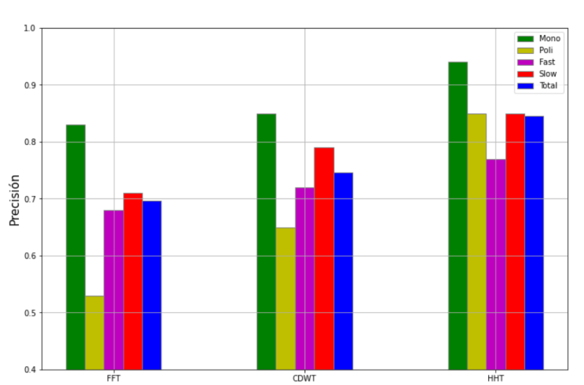

This research is conducted as part of the subject *Metodología de la Investigación* at UNTREF. The article aims to compare the differences between three types of time-frequency transformations:

1) Fourier Transform (FT)  
2) Wavelet Transform (WT)  
3) Huang-Hilbert Transform (HHT)  

The objective of this work is to understand the differences between these types of transformations and deepen my knowledge of signal processing.

## Objective
The general objective of the research is to determine which spectral analysis tool achieves the highest accuracy in pitch detection tasks.

To achieve this objective, the following specific objectives are proposed:  

- Identify the parameters needed to represent the signal in the spectral domain for each case.  
- Select an algorithm that identifies the pitch of the signal based on its spectral representation.  
- Generate the data (audio signals) to be used for the comparison.  
- Evaluate the generated data with the different analysis methods and apply statistical processes to validate the results.  
- Establish a measure of accuracy for the pitch detection task.  
- Compare the results of the different analyses and determine which method achieves the highest accuracy in pitch detection.  

The pitch detection task was chosen because it is one of the main applications of these types of transformations.

## Algorithms
The theoretical analysis of all the transformations is performed in the continuous domain, but to conduct the experiments and comparisons, the discrete domain is used, enabling all calculations to be performed digitally.

### FFT
The FFT is an algorithm that optimizes the DFT (Discrete Fourier Transform). With this algorithm, the spectral representation of the signal is obtained according to Fourier analysis, which decomposes a complex signal into a sum of sines or cosines. The DFT is calculated using the formula:

$$
X_k = \sum_{n=0}^{N-1} e^{-i\frac{2\pi}{N}kn} x_n
$$

Where \( N \) is the number of signal samples, and \( k \) are natural numbers from \( 0 \) to \( N – 1 \).

### WT
The Wavelet Transform (WT) uses an oscillatory function (wavelet) and applies a convolution between the signal and the chosen wavelet function to determine whether that wave shape is present in the signal. The wavelet is stretched and scaled in frequency and amplitude, allowing a single wavelet function to recreate the entire spectrum of interest.

In this research, the CDWT (Cyclic Discrete Wavelet Transform) will be used, the most common implementation when discretizing the WT. Conceptually, this transform extends Fourier analysis by projecting the signal onto a basis of wavelet functions instead of sines and cosines. It is calculated as follows:

$$
Wf[n, a^j] = \sum_{m=0}^{N-1} f[m] \psi_j[m-n]
$$

Where \( N \) is the number of signal samples, \( \psi \) is the wavelet function, and \( j \) represents the deformation of the wavelet according to the selected wavelet bank.

### HHT
Lastly, the Huang-Hilbert Transform (HHT) will be used for spectral representation. It employs a method called Empirical Mode Decomposition (EMD) to decompose the signal into subsignals that contain the relevant information of the original function.

Like the previous analysis methods, the key part of the analysis is the decomposition of the signal into simpler signals. However, instead of sine or wavelet functions, EMD finds intrinsic mode functions (IMFs) that form the basis of our decomposition and are unique to each signal. 

The relationship between the IMFs and the frequency of the original signal is established with the equation:  

$$
z(t) = f(t) + i H\{ f(t) \}
$$

Where \( f(t) \) is an IMF of the original signal, and \( H \) is the Hilbert Transform. This allows the IMF to be represented as a complex signal by projecting it onto the imaginary axis using the Hilbert Transform.

Thus, the IMF is represented as a complex signal, and the amplitude and phase of each moment can be extracted to construct the spectral representation. Since a signal generally has multiple IMFs, this process is repeated for all of them, and the results are summed to obtain the complete spectrum.

## Procedure
This research analyzes the relationship between types of spectral representation and accuracy in pitch detection.

First, the parameters for the different transformations will be selected. Among the most critical parameters to determine is the number of samples for temporal windowing, as it determines the trade-off between temporal and frequency resolution.

To ensure a fair comparison among the methods, data representing various cases of interest will be generated, including four types of signals:

- **Monophonic**: Signals with a single note corresponding to \( F_0 \).  
- **Polyphonic**: Signals with multiple notes where harmony determines \( F_0 \).  
- **Slow Transitions**: Signals with gradual changes in \( F_0 \).  
- **Fast Transitions**: Signals with abrupt changes in \( F_0 \).  

The real value \( V(t) \) will be compared to the result \( P(t) \) from each transform, integrating the difference over time to calculate the accuracy.

## Results
At this stage, the task was to complete the research plan detailing the procedure and analysis methods. Dummy data was generated and statistically validated to simulate expected results.

The graph compares the precision achieved by the three transformations for different signal types. Based on the properties of the transforms, the Wavelet Transform (WT) is expected to outperform the Fourier Transform (FT), and the Huang-Hilbert Transform (HHT) is expected to achieve the highest precision overall.

## Conclusions
In pitch detection tasks using spectral analysis, the Huang-Hilbert Transform (HHT) generally provides higher precision than the Fast Fourier Transform (FFT) and the Cyclic Discrete Wavelet Transform (CDWT).  

The significance of this precision gain depends on the type of signal being analyzed, with fast-transition signals benefiting the least from the transformation change, while polyphonic signals show the most significant improvement when using the HHT.

This project allowed me to deepen my understanding of signal processing and grasp the foundations of why tools like the WT and HHT are used based on the characteristics of the signal being analyzed.  

All details of this work are available in the following [report](https://drive.google.com/file/d/1G5kasP3BzZPVuxrXArHM72pUVlkN9b2Q/view?usp=sharing).
