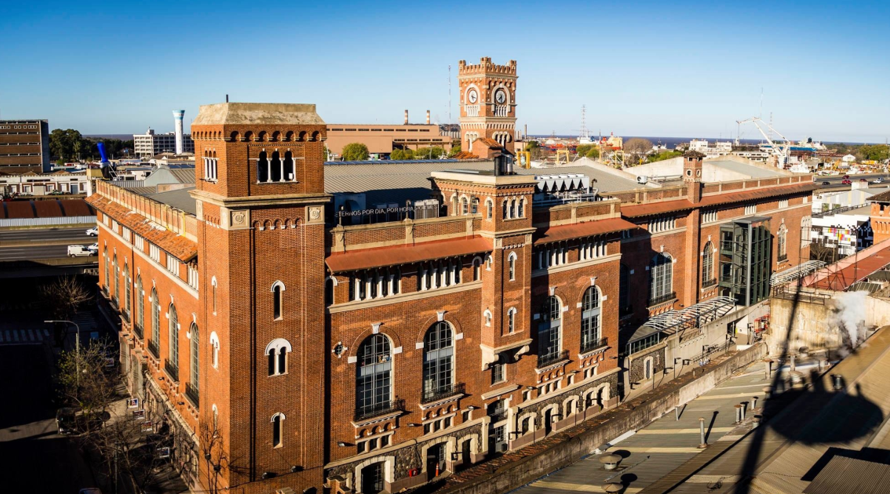
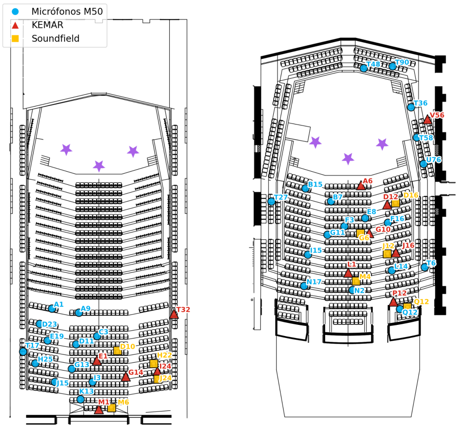
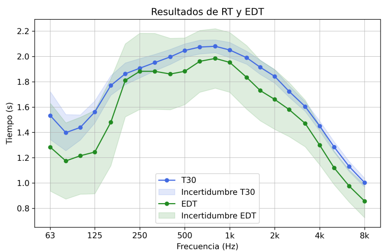
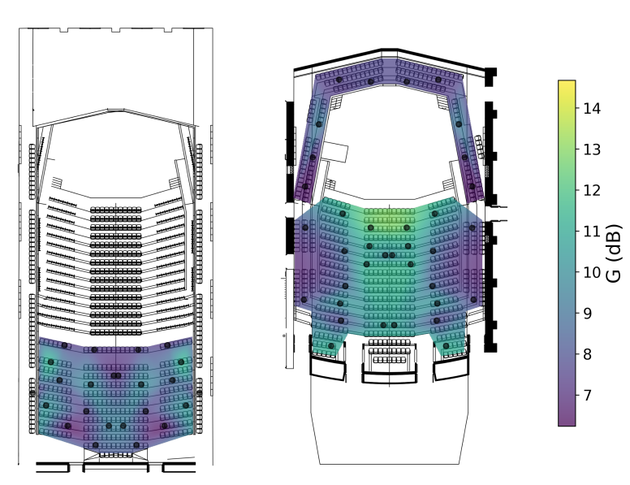
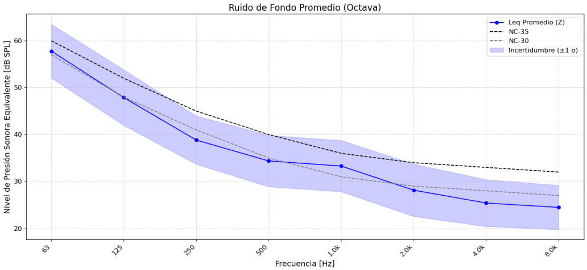

### **Introducción**

Esta medición fue parte de la materia *Instrumentos y mediciónes Acústica* del programa de Ingeniería de Sonido en UNTREF. Los **parámetros acústicos** obtenidos a partir de la respuesta al impulso son esenciales para evaluar el comportamiento de un recinto. Este informe presenta una caracterización integral del auditorio principal de la **Usina del Arte**, un centro cultural en Buenos Aires. El edificio, originalmente una planta generadora de energía del siglo XX con un distintivo estilo florentino-industrial, fue transformado con un diseño acústico que buscaba una calidad natural y equilibrada, sin necesidad de amplificación. Se implementó una estructura desacoplada (**box-in-box**) para el aislamiento y un acondicionamiento interior con materiales como madera de guatambú, superficies difusoras y un reflector acústico suspendido. El objetivo era un tiempo de reverberación de aproximadamente **2 segundos** y una distribución uniforme de las reflexiones tempranas laterales para una sensación envolvente.

### **Medición**
La caracterización se llevó a cabo el 9 de junio de 2025, donde se registraron  un total de **162 respuestas al impulso** monoaurales y binaurales. Se registraron datos desde 27 posiciones de micrófono y 3 de fuente. También se realizó un relevamiento del auditorio para analizar sus características constructivas y un análisis perceptivo.

Previo a las mediciones, se construyó un modelo del recinto en el software **EASE 4.3**, que estimó un volumen de **15,700 m³** y una frecuencia de Schroeder de **22.1 Hz**. El ruido de fondo se midió en ocho posiciones para evaluar el aislamiento, confirmando una relación señal/ruido superior a 40 dB. La disposición de los micrófonos se basó en la simetría del recinto para obtener un mapeo detallado.

Mas imágenes del proceso de la medición:



### **Procesamiento**

Se procesaron las grabaciones para obtener las respuestas al impulso y se calcularon diversos parámetros, siguiendo la norma **ISO 3382-1**:

* **Tiempo de reverberación:** $T_{20}$, $T_{30}$ y EDT.
* **Claridad:** $C_{50}$ y $C_{80}$.
* **Fuerza (G):** Diferencia de nivel de presión sonora entre la sala y una condición anecoica.
* **Fracción lateral (LF):** Proporción de energía sonora percibida desde los laterales.
* **Relación directo/reverberante (D/R).**
* **Inteligibilidad:** Se calculó el **Speech Transmission Index (STI)** y el Articulation Loss of Consonants (%Alcons).
* **Soporte de escenario:** $ST_{Early}$ y $ST_{Late}$, para evaluar las condiciones acústicas para los músicos.

Se utilizaron diferentes software comericales como el plugin Aurora Acoustical Parameters, el software EASERA, y también se calcularon otros parámetros con un scripts específicos en Python.

### **Resultados**

Los resultados muestran que el auditorio se comporta adecuadamente para una sala de conciertos, pero con áreas de mejora:

* **Tiempo de reverberación:** El promedio global fue de **1.92 s**. Sin embargo, se observaron variaciones notables en bajas frecuencias, donde el escenario flotante actúa como un resonador.

* **Claridad e Inteligibilidad:** Los valores de claridad para el habla están por debajo de los umbrales recomendados, y se identificaron problemas de inteligibilidad en ciertas zonas.

* **Factor de Nivel Sonoro (G):** El nivel de fuerza sonora presenta una variación baja considerando las dimensiones del auditorio.

* **Fracción Lateral (LF):** Los valores superan las recomendaciones, sugiriendo que la mayor parte del sonido proviene de los laterales. Esto podría estar relacionado con la gran cantidad de difusores.

* **Ruido de Fondo:** La sala presenta un nivel de ruido superior al recomendado para un recinto sinfónico (NC-35 vs. NC-20), probablemente debido al sistema de ventilación.

* **Difusión Sonora:** La repetición de una única secuencia de difusores disminuye su eficacia, generando un comportamiento lobular en lugar de una difusión estocástica.

Se proponen mejoras clave como reducir el ruido de fondo, optimizar la difusión sonora con secuencias no periódicas y equilibrar la respuesta espectral, corrigiendo la absorción en bajas frecuencias.

### **Conclusiones**
Pudimos caracterizar de forma efectiva el auditorio y se aplicaron la mayoría de temas teóricos vistos en clase a una experiencia práctica. El informe completo de este trabajo con todos los resultados y detalles de la medición se puede encontrar en el siguiente [informe](https://drive.google.com/file/d/1nSmWFrk30IFAhzBs9R42ZR61uK_ARc8z/view?usp=sharing).

