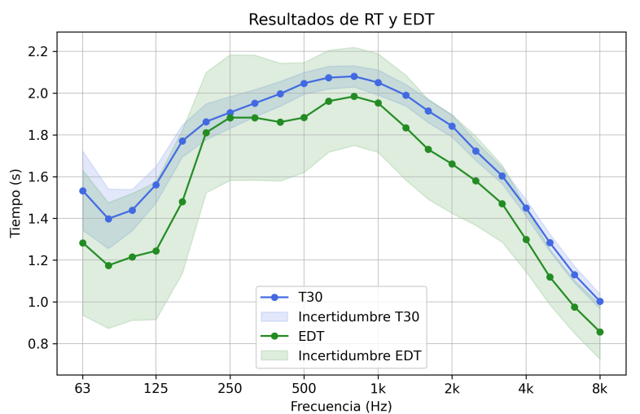
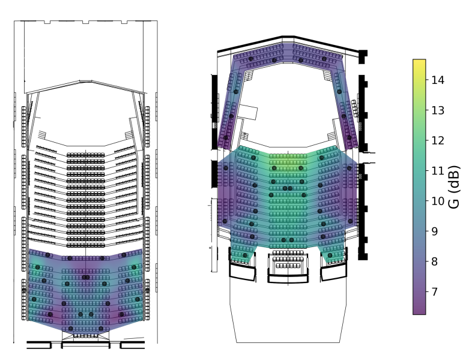

### **Introduction**

This measurement was part of the course *Instruments and Acoustic Measurements* of the Sound Engineering program at UNTREF. The **acoustic parameters** obtained from the impulse response are essential to evaluate the behavior of an enclosure. This report presents a comprehensive characterization of the main auditorium of the **Usina del Arte**, a cultural center in Buenos Aires. The building, originally a 20th-century power plant with a distinctive Florentine-industrial style, was transformed with an acoustic design that sought a natural and balanced quality without the need for amplification. A decoupled structure (**box-in-box**) was implemented for isolation and interior treatment with materials such as guatambú wood, diffusive surfaces, and a suspended acoustic reflector. The objective was a reverberation time of approximately **2 seconds** and an even distribution of early lateral reflections for an enveloping sensation.

### **Measurement**

The characterization was carried out on June 9, 2025, during which a total of **162 impulse responses** (monaural and binaural) were recorded. Data were captured from 27 microphone positions and 3 source positions. An on-site survey of the auditorium was also performed to analyze its constructional characteristics and a perceptual analysis was conducted.

Prior to the measurements, a room model was created in **EASE 4.3**, which estimated a volume of **15,700 m³** and a Schroeder frequency of **22.1 Hz**. Background noise was measured at eight positions to evaluate the isolation, confirming a signal-to-noise ratio greater than 40 dB. The microphone arrangement was based on the room’s symmetry to obtain a detailed mapping.

More images from the measurement process:



### **Processing**

Recordings were processed to obtain the impulse responses and various parameters were calculated following the **ISO 3382-1** standard:

* **Reverberation time:** \$T\_{20}\$, \$T\_{30}\$ and EDT.
* **Clarity:** \$C\_{50}\$ and \$C\_{80}\$.
* **Strength (G):** Difference in sound pressure level between the hall and an anechoic reference condition.
* **Lateral Fraction (LF):** Proportion of sound energy perceived from the laterals.
* **Direct/reverberant ratio (D/R).**
* **Intelligibility:** The **Speech Transmission Index (STI)** and the Articulation Loss of Consonants (%Alcons) were calculated.
* **Stage support:** \$ST\_{Early}\$ and \$ST\_{Late}\$, to assess acoustic conditions for musicians.

Various commercial software tools were used, such as the Aurora Acoustical Parameters plugin and the EASERA software, and additional parameters were computed with specific Python scripts.

### **Results**

The results show that the auditorium behaves adequately for a concert hall, but with areas for improvement:

* **Reverberation time:** The global average was **1.92 s**. However, notable variations were observed at low frequencies, where the floating stage acts as a resonator.

* **Clarity and Intelligibility:** Clarity values for speech are below recommended thresholds, and intelligibility issues were identified in certain zones.

* **Sound Strength (G):** The sound strength level shows a low variation considering the auditorium’s dimensions.

* **Lateral Fraction (LF):** Values exceed recommendations, suggesting that most of the sound energy comes from the laterals. This may be related to the large number of diffusers.

* **Background Noise:** The room presents a noise level higher than recommended for a symphonic venue (NC-35 vs. NC-20), likely due to the ventilation system.

* **Sound Diffusion:** Repetition of a single sequence of diffusers reduces their effectiveness, producing a lobed behavior instead of stochastic diffusion.

Key improvements are proposed, such as reducing background noise, optimizing sound diffusion with non-periodic sequences, and balancing the spectral response by correcting low-frequency absorption.

### **Conclusions**

We were able to effectively characterize the auditorium and apply most of the theoretical topics covered in class to a practical experience. The full report of this work with all results and measurement details can be found in the following [report](https://drive.google.com/file/d/1nSmWFrk30IFAhzBs9R42ZR61uK_ARc8z/view?usp=sharing).
